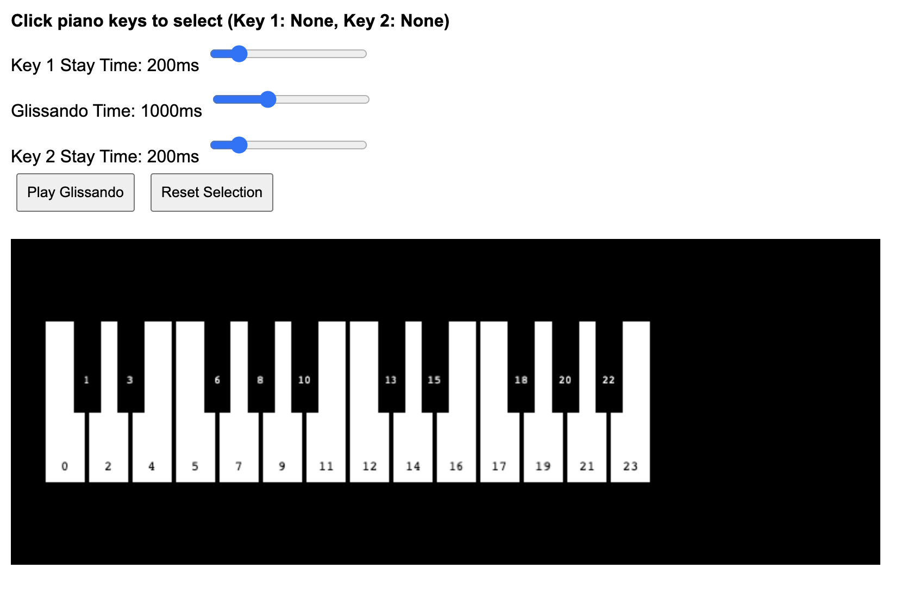

# Piano Glissando Tool

An interactive web-based piano glissando tool built with Phaser.js and Web Audio API.



## Features

- Visual piano keyboard (2 octaves, 24 keys)
- Click keys to select start and end notes
- Adjustable timing controls via sliders:
  - Key 1 stay time (0-2000ms)
  - Glissando transition time (100-3000ms)
  - Key 2 stay time (0-2000ms)
- Real-time audio synthesis with smooth frequency transitions
- Visual feedback during playback

## Usage

1. Open `index.html` in a web browser
2. Click a piano key to select the starting note (turns blue)
3. Click another key to select the ending note (turns red)
4. Adjust the timing sliders as desired
5. Click "Play Glissando" to hear the effect
6. Click "Reset Selection" to choose different keys

## Running Locally

```bash
python3 -m http.server 8888
```

Then open `http://localhost:8888` in your browser.

## Future Enhancements

- Support for 3+ keys in sequence
- Multiple glissando patterns
- Save/load presets
- Different waveform types
